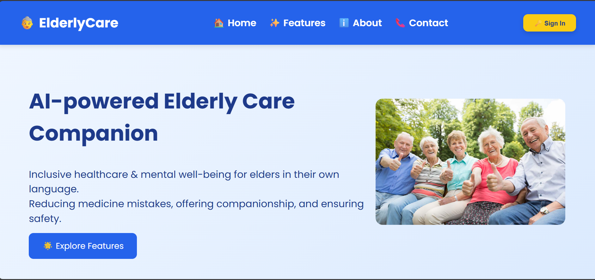
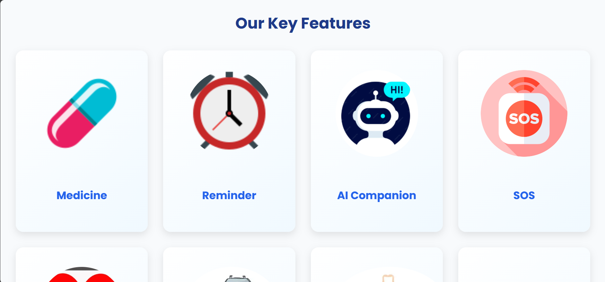
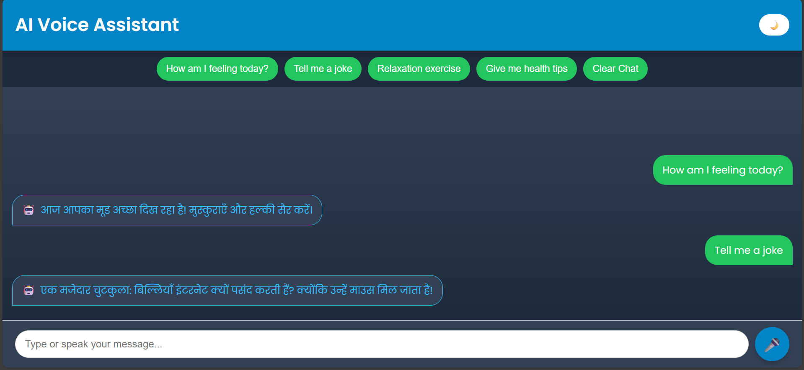

# 🌼 Elderly Care Companion — Frontend Web Application

**Elderly Care Companion** is a web-based platform designed to support elderly individuals in managing healthcare routines, daily activities, safety needs, and emotional well-being. The application emphasizes **simplicity, accessibility, and comfort**, helping seniors maintain independence while providing reassurance to families.

> 📌 **Note:** This project is currently **frontend-only** with **no backend or cloud services** connected.

---

## 🎥 Video Demo

Watch the complete working demonstration here:

👉 **Video Link:** _[Add Video Link Here]_

---

## 🌐 Live Demo

View the hosted live build here:

👉 **GitHub Pages:** [Ai-Powered-Elderly-Care-Companion](https://jagtap-srushti.github.io/AI-powered-Elderly-Care-Companion/)

---

## 🌟 Key Highlights

- Senior-friendly UI with intuitive navigation  
- Large visuals & readable typography  
- Voice/audio support for reminders  
- SOS safety mechanism for emergencies  
- Guided relaxation and wellness activities  

---

## 🚀 Core Features

| Feature | Description |
|---------|-------------|
| **AI Companion** | Chat-based interaction promoting companionship & mental well-being |
| **Medicine Reminder** | Visual and audio reminders for scheduled medication |
| **Daily Task Reminders** | Helps seniors remember essential daily actions |
| **SOS Functionality** | Quick-action alert button for emergencies |
| **Health Tracker** | UI for tracking vitals (steps, BP, sleep, etc.) |
| **Medicine Scanner** | Image scanning UI for identifying medicines |
| **Guided Yoga & Meditation** | Relaxation poses and breathing exercises |
| **Family Video Call UI** | User interface simulating video-call interactions |

> These modules are **UI simulations** showcasing how a real-world elderly care system may function.

---

## 🧩 Tech Stack

| Layer | Technology |
|-------|------------|
| **Frontend** | HTML, CSS, JavaScript |
| **Media** | Images, Icons, Audio (MP3) |
| **Storage** | Browser memory / variables (no database) |
| **Rendering** | Static pages with basic scripting |

---

## 👵 Problem Motivation

As people age, they commonly face challenges such as:

- Forgetting medication schedules  
- Lack of communication & emotional support  
- Limited mobility & health monitoring  
- Anxiety and stress  
- Safety concerns during emergencies  

**Elderly Care Companion** aims to reduce these challenges through a **lightweight & accessible digital support system.**

---

## 🖼 Screenshots (UI Snapshots)

### 🏠 Home Page

### 💊 Medicine Reminder

### ⚡ SOS Functionality

## ⚠ Assets / Images Notice

Some images, icons, and logos used in this project were sourced from the internet for **demonstration purposes only** and are **not owned by the author**.  

The **code and functionality** of this project are licensed under the MIT License.

---

## 📜 License

This project is licensed under the **MIT License** — see the [LICENSE](./LICENSE) file for details.

